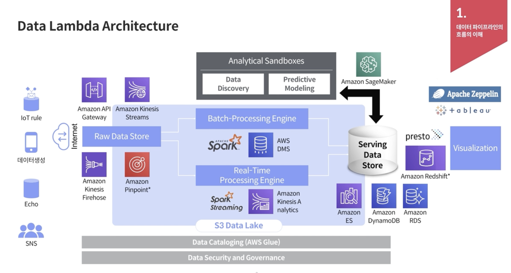
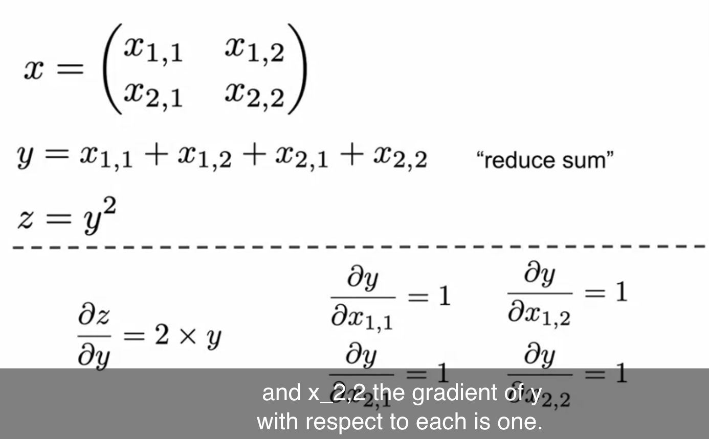

### Data Pipeline Archintecture


1. 수집
    - Kinesis Streams
    - Kinesis Firehose
    - API Gateway
    - Lambda function 
    - Amazon pinpoint (비용 절감이 가능)

2. 전처리 및 저장
    - AWS Glue
        - Data Catalog
    - S3
    - Amazon EMR
        - Hadoop echo system

3. 분석 및 시각화
    - Athena
    - Apache Zeppelin
    - tableau


### 데이터 파이프라인 구성방안
1. 회사내 데이터적 요구 case에 대한 빠른 대응
2. 지속적, 에러가 없어야 함
3. 이벤트성 데이터 부하에도 처리가 가능해야 함 (마케팅 이벤트, 푸시 발송 등)
4. 데이터 쌓이는 공간에 문제가 없어야 함.
5. 수집 데이터, 저장데이터의 유연성(변경이 잦은 것에 대응)
6. 쉬운 분석데이터 Format. (ex. json)


### Data lambda architecture

Kafa 대비 비용 효율적, 가장 일반적임.

- Batch-Processing Engine
    - AWS DMS
        - 고객 master, 상품 master 등 테이블을 그대로 가져오는 경우 사용
        - Spark로 가져오면 DB에 부하를 많이 줌.
- Serving Data Store
    - Amazon Elastic Search : 용량이 계속 증가하는 서비스의 경우 좋지 않음.
    - DynamoDB
    - RDS
    - Redshift (MPP)
    - presto



### Data 분석 대상

1. Web 에서 발생하는 Event
    - 웹 사이트에서 클릭


### 데이터 파이프라인을 위한 AWS 서비스

1. EC2
    - 가상 컴퓨팅 환경
    - AMI (amazon machine image)
    - instance type
    - volumne : 임시 데이터를 저장, 인스턴트 종료 시 삭제됨.
    - Amazon EBS(Elastic Block Store) : 영구 스토리지 볼륨에 저장
    - 보안그룹 : policy
    - 탄력적 IP 주소 (EIP) : public ip는 dynamic하게 변경되므로, 변경되지 않게 하려면 EIP를 할당하면 됨. EIP는 할당해 놓고 쓰지 않을때 비용이 발생함.
    - tag : EC2뿐만 아니라 다른 서비스에 tag를 잘 달아야 비용 산정 등을 잘 분류할 수 있음.

2. S3
    - 버킷
    - 객체
    - 키(버전을 포함)
    - 생명주기를 관리 가능. 일정주기가 지나면 glacier로 archiving 가능

3. RDS
    - Oracle
    - MySQL, PostgreSQL ...
    - Aurora

4. API Gateway

5. CloudWatch
    - 모니터링, 알람, 리소스 자동 변경 등
    - kinesis 같은 Queue 서비스의 경우, cloud watch가 monitoring 하다가 pod를 늘려주는 게 가능.


### 실습

- Kafka
    - LinkedIn에서 개발된 분산 메시징 처리 시스템
    - 대용량 실시간 로그 처리에 특화됨.
    - Producer and Consumer (producer 가 데이터 생성, consumer에 저장, 전송 등)


#### Gradient computation in tensorflow

예를 들어 $w^2$ 라는 loss 가 있으면 gradient는 $\frac{d}{dw}w^2=2w$ 이다.
이걸 tensorflow 에서 계산하려면 `GradientTape` 를 활용한다.

`GradientTape`은 자동으로 미분을 해주는 기능인데, context 안에서 실행된 모든 연산을 tape에 기록한다.

```python
w = tf.Varaible([[1.0]])
with tf.GradientTape() as tape:
    loss = w*w
```

- chain rule
  - 아래 코드를 보면,
    ```python
    x = tf.ones((2,2))
    with tf.GradientTape() as t:
        t.watch(x)

        y = tf.reduce_sum(x)
        z = tf.square(y)

    dz_dx = t.gradient(z,x)
    ```
    $\frac{\partial z}{\partial x}=\frac{\partial z}{\partial y} \frac{\partial y}{\partial x}$

    

- 실제 활용 방식

```python
def train_step(images, labels):
    with tf.GradientTape() as tape:
        # step1. 예측 결과
        logits = model(images, training=True)
        
        # step2. loss 계산
        loss_value = loss_object(labels, logits)
    
    loss_history.append(loss_value.numpy().mean())
    grads = tape.gradient(loss_value, model.trainable_variagles)
    optimizer.apply_gradients(zip(grads, model.trainable_variables))
```


###