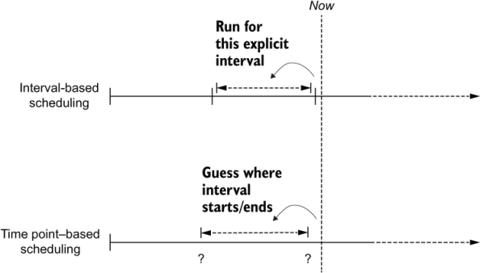

# Airflow 기초 개념 이해하기
 
### Airflow 란
무엇이고, 왜 필요한지

- 언제, 어느 경우에 사용하는가?

### Workflow management system
Oozie, Control-M, Cron, Luigi


### Airflow 기본 구성 요소
- Scheduler
- Web Server
- Worker


### 기본 용어 이해하기
- DAG(Directed Acyclic Graph)
    - 비순환 그래프
- Operator, tasks
    - operator 는 ```BashOperator```, ```PythonOperator``` 와 같이 단일 작업을 수행하는 단위
    - task는 operator와 일반적으로 동일한 개념이지만 코드, 클래스 개념으로는 Operator라는 용어를, Airflow UI 상에서 dag를 재수행 하거나 최소단위의 작업을 task라고 부름.
- (Jinja) Templates
    - Variables
        - ```{{ ds }}```
    - Macros
        - ```{{ macros.timedelta }} ```
- logical_date
    - Variable 중 ```logical_date``` 값은 실제 해당 DAG를 수행하는 시간이 아니라, 현재 interval의 시작시점을 의미함. (참고로, Airflow 구버전에서는 ```execution_date``` 라는 이름이었는데, 혼동을 주어서인지 ```logical_date```로 바뀜)

  
### 스케쥴 관리하기
개인적으로 Airflow를 처음 사용할 때, 가장 애매하고 실수를 많이 했던 부분이 스케쥴을 적용하는 부분이었습니다.

DAG를 설정하는데 start_date, schedule_interval, (optionally) end_date 옵션을 잘 이해해야 한다.

만약, 오늘이 2023년 5월 11일이고, 
2023년 5월 12일 오전 9시 부터 매일 오전 9시(daily)에 DAG를 수행하고 싶다고 하면, start_date와 schedule_interval을 어떻게 설정하면 좋을까?

```python
dag = DAG(  
    'dag-email-test',
    start_date=datetime(2023, 5, 12, tzinfo=local_tz),
    schedule_interval='0 9 * * *'
)
```

만약 위와 같이 설정한다면, 23년 5월 12일에 아무 일도 일어나지 않을 것입니다. 대신, 하루가 지나 5월 13일 09시에 해당 DAG가 수행 될 것입니다.

다시 정리하면, Airflow 에서는 첫번째 interval의 시작 시각과 Interval을 더한 시간(여기서는 5월 12일이 시작 시각이고, interval이 1일임) 이후에 첫 trigger가 발생합니다.

그 이유는, Airflow 는 간격 기반(Interval-based) 스케줄링 방식을 채택하고 있기 때문입니다.


(출처 : Data Pipelines with Apache Airflow, Manning)

여기서 다시 나오는 용어가 ```logical_date``` 입니다. logical_date는 다시 말하면 실제 DAG가 수행되는 시각이 아니라, 현재 interval에서 시작 시점을 이야기 합니다. 

그 외에 추가적으로 알아야 할 옵션들은 다음과 같음.

- depends_on_past
- retries
- catchup
- retries, retry_delay
- email, email_on_failure, email_on_retry


DAG를 선언하는 예제입니다.

```python
default_args = {  
    'owner': 'admin',
    'depends_on_past': False,
    'start_date': datetime(2022, 10, 9, tzinfo=local_tz),
    'retries': 0,
    'retry_delay': timedelta(minutes=10),
    'provide_context': True,
    'email': ['admin@airflow.com'],
    'email_on_failure': True,
    'email_on_retry': False
}

dag = DAG(  
    'dag-email-test',
    default_args=default_args,
    dagrun_timeout=timedelta(hours=2),
    schedule_interval='@once',
    catchup=False
)
```

### Backfilling


---
참고자료

- ...
- ...
